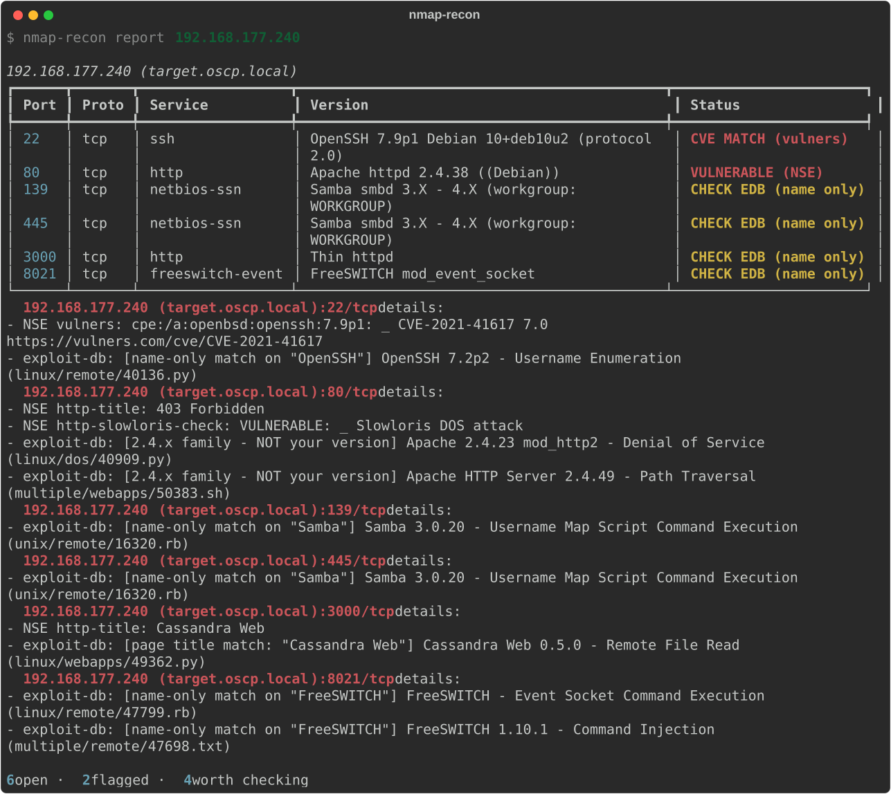

# oscp-toolkit

[](LICENSE)
[](https://www.python.org/)
[](https://pipx.pypa.io/)
[](#the-exam-line)

Seven read-only enumeration helpers for OSCP+ prep and exam day. One install, one
shared core, one set of conventions.

They used to be seven separate scripts in seven separate repos, each with its own
copy of the same validation and output-scrubbing code. When I fixed a terminal-injection
bug in one, the other three kept it. That's why they're one package now.



*Real captured output, not a mockup — `docs/make_demo.py` records it through rich's
SVG recorder. Note the exploit-db tiering: `Cassandra Web` was found from the page
title rather than the service banner (the banner says "Thin httpd"), and the Apache
hits are labelled **NOT your version** so a near-miss can't read as a finding.*

Each tool prints its own sigil and wordmark on startup, so four tmux panes are
distinguishable at a glance:

```
  ▄▄    _  _ __  __   _   ___     ___ ___ ___ ___  _  _
 ▟▘▝▙  | \| |  \/  | /_\ | _ \___| _ \ __/ __/ _ \| \| |
▐  ● ▌ | .` | |\/| |/ _ \|  _/___|   / _| (_| (_) | .` |
  ▀▀   |_|\_|_|  |_/_/ \_\_|     |_|_\___\___\___/|_|\_|
       five stages in, one table out
       oscp-toolkit v2.1.0 · enumeration only

▛▀▜     _    ___ ___  ___  _    ___      ___ _____   _____ _____
▌ ▐═══ | |  |_ _/ __|/ _ \| |  / _ \ ___| _ \_ _\ \ / / _ \_   _|
▌ ▐═══ | |__ | | (_ | (_) | |_| (_) |___|  _/| | \ V / (_) || |
▙▄▟    |____|___\___|\___/|____\___/    |_| |___| \_/ \___/ |_|
       tunnel up, routes in, out of the way
       oscp-toolkit v2.1.0 · enumeration only
```

## Install

```bash
pipx install git+https://github.com/joseadejezus/oscp-toolkit
```

That gives you all eight commands. The base install has **zero dependencies** on
purpose, so it works in a container with no network. Optional extras make the
output nicer:

```bash
pipx inject oscp-toolkit rich defusedxml    # prettier tables, hardened XML parsing
pipx inject oscp-toolkit neo4j              # required for bh-quickwin only
pipx inject oscp-toolkit ldap3              # ad-enum's clock-skew preflight
```

Everything degrades gracefully without them — plain text instead of tables, a
warning instead of a crash. `bh-quickwin` is the one exception: it *is* a bolt
client, so it needs `neo4j`. Even then `--help` still works and the error tells
you the fix.

### Exegol

`my-resources/bin/` is a live bind mount, so this installs into every container,
present and future, with no pip step and no network:

```bash
git clone https://github.com/joseadejezus/oscp-toolkit
cd oscp-toolkit
./install-exegol.sh
```

That drops the package into `~/.exegol/my-resources/bin/.oscp-toolkit/` and writes
one small launcher per command beside it. Running containers pick it up immediately.
To update, `git pull` and run it again.

> Don't symlink the launchers back to your clone — only `my-resources` is mounted
> into the container, so the link dangles inside Exegol.

## The commands

| Command | What it does |
|---|---|
| `nmap-recon` | Runs my five-stage nmap flow and merges it into one table, with exploit-db and NSE cross-references tiered by how well they actually match |
| `http-serve` | Serves a loot dir and prints paste-ready `certutil`/`wget` lines with your tun0 IP filled in — then logs every request so you know the transfer landed |
| `ad-enum` | One credential, one DC, five read-only enumeration stages merged into one report, with automatic fallbacks when nxc is unhappy |
| `hash-triage` | Classifies a pile of found hashes, splits them per hashcat mode, runs a local wordlist pass and reports what cracked |
| `bh-quickwin` | Reads roastable accounts, unconstrained delegation and owned→DA paths straight out of the BloodHound graph |
| `ligolo-pivot` | The tun + route dance for Ligolo-ng in one command, idempotent in both directions |
| `script-logger` | Records the terminal per box, builds the evidence tree, and keeps a timestamped command timeline |
| `mark` | Stamps a marker into the current `script-logger` session — same tool, second entry point |

Each one prints its own banner so you can tell four tmux panes apart at a glance,
and each has worked examples in `--help`.

## Conventions they all share

This is the part that makes them a set rather than a pile.

**Exit codes** mean the same thing everywhere, so they chain predictably:

| Code | Meaning |
|---|---|
| 0 | ok |
| 1 | bad input or flags, or a step couldn't run |
| 2 | ran fine, but there was nothing to report |
| 3 | something it needs is busy or unreachable |
| 130 | interrupted |

A mistyped flag exits **1**, not argparse's default 2 — otherwise a typo would
look like an empty result to anything checking `$?`.

**`--json`** on every tool, with an identical envelope. Tool-specific data lives
under `data`; everything above it is the same shape:

```json
{
  "tool": "nmap-recon",
  "tool_version": "2.1.0",
  "suite": "oscp-toolkit",
  "schema_version": 1,
  "generated_utc": "2026-08-23T18:12:04+00:00",
  "subject": "192.168.177.240",
  "summary": "6 open · 2 flagged · 4 worth checking",
  "notes": [],
  "data": { "ports": [] }
}
```

Pass `--json -` for stdout — that suppresses the banner and the tables so it pipes
cleanly:

```bash
nmap-recon report 10.10.10.10 --json - | jq -r '.data.ports[] | select(.status != "no known hit") | .port'
ad-enum report 10.10.10.5 -d corp.local --json - | jq -r '.data.roastable[].sam'
```

**Banners** appear only at a real terminal. Piped or redirected output has zero
escape bytes, so `| tee notes.txt` stays clean. `--no-banner` and `OSCP_NO_BANNER=1`
also work.

**They hand off to each other:**

```
ad-enum sweep …        → kerb.<dc>.txt / asrep.<dc>.txt  → hash-triage crack …
ad-enum "writable"     → confirm the abuse path in       → bh-quickwin wins
nmap-recon --json      → ports worth a closer look
```

## Security practices

Every tool follows [project-codeguard](https://github.com/cosai-oasis/project-codeguard),
and the enforcement now lives in one shared module instead of seven copies:

- **No `shell=True`, anywhere.** Every external command is an argv list. There's a
  test that fails if one appears.
- **Allow-lists reject, they don't sanitise.** A target with a `;` in it is a hard
  stop, not something to quietly clean up. The one documented exception is a
  password — a real credential can contain any punctuation, so it's checked for
  control characters and length only, which is safe precisely because `shell=False`
  makes its content inert.
- **Explicit timeouts and explicit return-code handling** on every subprocess. The
  three calls without a timeout are long-running by design (an interactive recorded
  shell, and the file server you stop with Ctrl-C) and say so in a comment.
- **Terminal-injection scrubbing on everything displayed.** Service banners, page
  titles, sAMAccountNames, LDAP attributes and loot filenames all come off a box
  you don't control. A crafted one can repaint or hijack your terminal. Every tool
  scrubs on the way *in*, at one choke point, so no render path can skip it.
- **Credentials are masked** in echoed commands and saved logs, so they never leak
  into a `script-logger` transcript.
- **Optional dependencies degrade**, never crash.

## The exam line

Every tool here stays on the *enumeration* side of OffSec's rule. They scan, parse,
aggregate, transfer, track state and report. **None of them selects or fires an
exploit, and none chains one finding into the next attack.**

Concretely, where each one stops:

- `nmap-recon` — everything is a lookup: NSE output, or an exploit-db *title*. The
  tier tags exist so a weak name-only match can't be mistaken for a confirmed finding.
- `ad-enum` — roasting collects hashes for offline cracking, the way Impacket's
  `-request` does. It never cracks and then authenticates. `bloodyAD` is locked to
  `get` verbs, so "writable" means *rights worth checking in BloodHound*, not rights
  abused. MAQ and ADCS are presence checks — no template abuse, no cert request, no
  ESC-anything. It never runs an auto-exploit module (no zerologon, ms17-010 or nopac).
- `hash-triage` — cracking already-dumped hashes locally against a wordlist is
  allowed. It reports the plaintext; spraying or reusing it is your call, by hand.
  **Keep it local** — don't point the wordlist step at an external or distributed
  cracking service.
- `bh-quickwin` — BloodHound is explicitly allowed. This only re-reads its graph and
  annotates owned, the same as right-clicking in the GUI. Every hop is still yours.
- `http-serve` / `ligolo-pivot` — transport and file transfer. They never contact a
  target or choose a payload.
- `script-logger` / `mark` — documentation only. Records your own terminal.

One caveat that isn't about this code: if you use LinPEAS, keep it in plain
enumeration mode and never invoke its exploit features. That's the exact scenario
OffSec has publicly ruled on.

## Known gaps

Nothing here has touched a real target yet — every on-wire seam is tested against
fakes, so expect a small parsing tweak on first contact. Specifically: `bh-quickwin`'s
Cypher has never run against a live Neo4j; `ad-enum` keys off nxc output that drifts
between versions, so the raw per-stage `.log` is authoritative; and `http-serve`'s
request log parses CPython's `http.server` format — if that ever changes the summary
silently reads "no requests", and `--raw` is the escape hatch.

## Licence

MIT — see [LICENSE](LICENSE).
